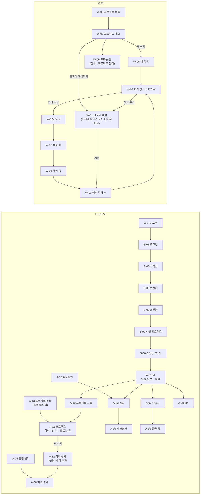
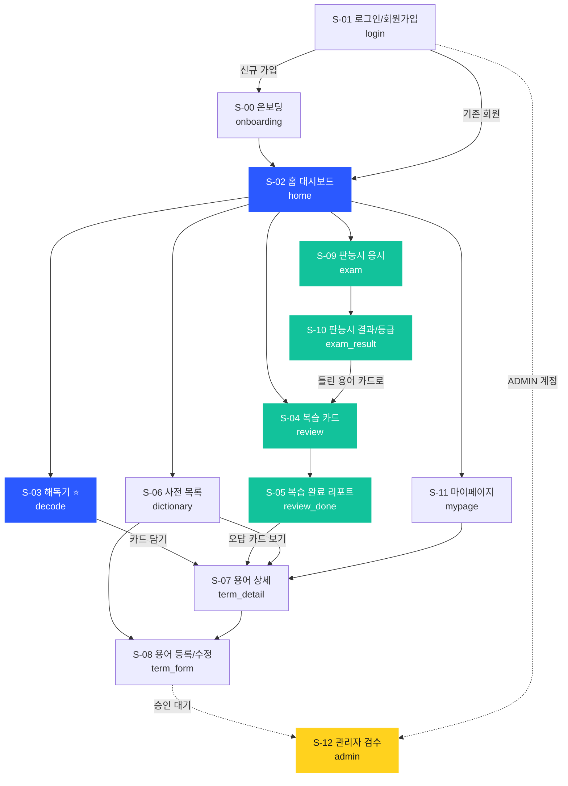

# 02. UI 흐름도 — v5.2 (프로젝트 → 회의 → 해석 · 할 일 · 모르는 말)

> 이 문서가 **Figma 작업 지시서 원본**이자 **기술서 UI 흐름 슬라이드의 대본**이다.
> 전기수 관례를 따라 모든 화면에 🟩🟥🟦 주석을 단다.
> 🟩 초록 = UI 이동 / 🟥 빨강 = API 및 기능 설명 / 🟦 파랑 = 모달·특이사항
> 화면 캡처: `figma-export/png_v5/` (32장) · 갤러리 `figma-export/v5.html`

---

## v5.2 플랫폼 흐름 (2026-09-16 밤 — 프로젝트 → 회의 → 해석 · 할 일 · 모르는 말)

> **메시지 해석** = 회의와 상관없이 슬랙·메일·캡처를 붙여넣어 해석한 것 (meetingId 없음). 기능은 앱·웹 동일, 긴 회의는 웹이 보기 편함.

| 플랫폼 | 화면 |
|---|---|
| **iOS 앱 (22)** | O-1~3, S-01, S-00-1~5, A-01~13 |
| **웹 1440 (10)** | W-08 프로젝트 목록, W-00 프로젝트 개요, W-06 새 회의, W-07 회의 상세, W-01 판교어 해석, W-02a 녹음 동의, W-02 녹음 중, W-04 해석 중, W-03 해석 결과, W-05 모르는 말 |
| **공통** | 같은 계정 · 같은 DB (기기 연결·보내기 없음) |



| ID | 화면 | 🟥 API | 🟩 이동 / 🟦 특이사항 |
|---|---|---|---|
| O-1 | 소개 ① 판교어 폭격 | 없음 (정적) | 🟦 회의에서 판교어를 쏟아내는 장면 |
| O-2 | 소개 ② 붙여넣으면 해석 | 없음 (정적) | 🟦 기능은 앱·웹 동일, 웹은 긴 회의에 편함 |
| O-3 | 소개 ③ 알림 · 퇴근길 복습 | 없음 (정적) | 시작하기 → S-01 |
| S-01 | 로그인 | `POST /auth/oauth/{provider}` → `isNewUser` · `needsOnboarding` | `needsOnboarding=true` → S-00-1 · provider = apple · kakao · google |
| S-00-1 | 직군 | 없음 (`jobGroup`은 S-00-5의 `POST /onboarding`에서 저장) | 건너뛰기 가능 → S-00-2 |
| S-00-2 | 레벨 진단 | `GET /onboarding/diagnosis-terms?size=10` | 🟦 설문 Q4와 같은 10개 단어 |
| S-00-3 | 알림 설정 | `PATCH /users/me/notification-settings {reminderHour, actionAlertEnabled}` · `POST /devices {platform: IOS, pushToken}` | 🟦 iOS 시스템 알림 권한 팝업 |
| S-00-4 | 첫 프로젝트 | `POST /projects {name, description, color}` | 나중에 → "내 프로젝트" |
| S-00-5 | 등급 안내 · 준비 완료 | `POST /onboarding` → `createdCardCount` · `estimatedLevel` | 홈으로 → A-01 · 🟦 5단계 사다리 (goal-gradient) |
| A-01 | 홈 | `GET /users/me/stats` · `GET /actions?projectId=&checked=false` | 프로젝트 칩 → A-10 · 할 일 출처 → A-12 |
| A-13 | 프로젝트 목록 | `GET /projects` | 프로젝트 탭 첫 화면 → A-11 |
| A-10 | 프로젝트 시트 | `GET /projects` · `POST /projects` · `PATCH /users/me` | 🟦 시트 |
| A-11 | 프로젝트 | `GET /projects/{id}` · `GET /projects/{id}/meetings` | 판교어 해석 · 새 회의 버튼 |
| A-12 | 회의 상세 | `GET /meetings/{id}` · `POST /meetings/{id}/recordings` | 🟦 녹음 동의 필수 |
| A-06 | 해석 결과 | `GET /translations/{id}` · `PATCH …/actions/{id}` · `POST /cards/bulk` | 할 일은 이 회의에 저장 |
| A-02 | 잠금화면 알림 | 서버 → APNs 푸시 (`notifications.type` = REVIEW_REMINDER · ACTION_DUE · DECODE_DONE · LEVEL_UP) | 복습 → A-03 / 할 일 → A-12 / 해석 완료 → A-06 |
| A-03 | 퇴근길 복습 · 앞면 | `POST /reviews/sessions` → `sessionId` · `cards[]` (0장 → 422) | 🟦 앞면엔 판교어만 · 출처 칩 = `cards[].source {projectName, meetingTitle}` |
| A-04 | 복습 뒷면 + 자가평가 | `POST /reviews/sessions/{id}/answers {cardId, rating}` → `nextIntervalDays` | 🟦 버튼 아래 "N일 뒤" 미리보기 |
| A-05 | 알림 센터 (iOS 시스템) | APNs payload (category=REVIEW_REMINDER · thread-id · 배지) · `GET /notifications`는 배지 계산용 | 🟦 길게 눌러 펼친 알림 · 지금 복습 → A-03 / 해석 완료 → A-06 / 등급 업 → A-08 |
| A-07 | 판능시 · 5문제 | `POST /quizzes` → `quizId` · `questions[]` | 제출 → A-08 · 🟦 3문제는 내가 들은 말 |
| A-08 | 판능시 결과 · 등급 업 | `POST /quizzes/{quizId}/submit` → `score` · `level` · `levelUp` | 🟦 `users.level_code` 갱신 → `LEVEL_UP` 알림 (Lv2 → Lv3) |
| A-09 | MY | `GET /users/me` · `GET /users/me/stats` · `GET /levels` · `PATCH /users/me/notification-settings` | 🟦 5단계 목록 (지난 · 지금 · 잠김) |
| W-08 | 프로젝트 목록 | `GET /projects` · `POST /projects` · `GET /actions` | 로그인 후 첫 화면 → W-00 |
| W-00 | 프로젝트 개요 | `GET /projects/{id}` · `GET /projects/{id}/meetings` · `GET /translations?projectId=&meetingId=none` · `GET /actions?projectId=` · `GET /cards?projectId=` | 회의 행 → W-07 |
| W-06 | 새 회의 | `POST /projects/{id}/meetings` | 🟦 모달 · 만들고 바로 녹음 → W-02a |
| W-07 | 회의 상세 | `GET /meetings/{id}` | 회의록 = 이 페이지 |
| W-01 | 판교어 해석 | `POST /translations {projectId, meetingId?}` · `POST /uploads/ocr` | "붙일 회의" 선택 |
| W-02a/02/04 | 녹음 | `POST /meetings/{id}/recordings` (1분 조각 · `recordingId` · 마지막 `final=true`) → 202 · `GET /recordings/{id}` → status RECORDING · `transcript`(부분 = 실시간 받아쓰기) → TRANSCRIBING → DONE | 🟦 consentConfirmed=false → 400 |
| W-03 | 해석 결과 | `GET /translations/{id}` · `PATCH …/actions/{id} {isChecked, alertEnabled}` · `POST /cards` | ← 회의 상세 |
| W-05 | 모르는 말 | `GET /cards?projectId=&due=` · `PATCH /cards/{id}` | 전체 단어장 + 프로젝트 칩 |

> 아래는 이전 버전 기록(참고용).

---
---

> ⚠️ **아래(§0 이후)는 v1~v4 설계 기록**입니다. 화면 ID·이름이 현재(v5.2)와 다릅니다. 발표·제출 기준은 위 v5.2 섹션과 `keynote/10_ui_flow.png`.

## 0. (이전 기록) 전체 UI 흐름도



**액터별 진입 경로**
| 액터 | 흐름 |
|---|---|
| 신입 사용자 | S-01 → **S-00 온보딩(최초 1회)** → S-02 → (S-03 해독 / S-04 복습 / S-06 사전 / S-09 판능시) → S-11 |
| 기여자 | S-02 → S-06 → S-07 → S-08 (용어 등록) |
| 관리자 | S-01 → S-12 (검수·신고 처리·오늘의 판교어 지정) |

---

## 화면 공통 규칙

| 항목 | 값 |
|---|---|
| 데스크톱 | 1440 × 1024, 콘텐츠 최대폭 1120, 좌우 여백 24 |
| 모바일 | 390 × 844 (S-02·S-03·S-04만 추가 제작 → 3D 목업용) |
| GNB | 로고 / 해독기 / 복습 🔴N / 사전 / 판능시 / 프로필 (guest·member·admin 3 variant) |
| 빈 상태 | 마스코트 "인교" 일러스트 + 한 줄 카피 + 행동 버튼 |
| 토스트 | 우측 하단, 3초 후 자동 소멸 |

---

## S-01 로그인 / 회원가입 `login`

**목적** 서비스 진입, 역할 분기

| 구성 요소 | 데이터 필드 | 비고 |
|---|---|---|
| 로고 + 슬로건 | - | "물어보기 부끄러운 말, 3초 만에" |
| **[Google로 계속하기]** | `code`, `redirectUri` | 소셜 버튼 (최상단) |
| **[카카오로 계속하기]** | `code`, `redirectUri` | 소셜 버튼 |
| 구분선 "또는" | - | |
| 이메일 입력 | `email` | placeholder `newbie@pangyo.com` |
| 비밀번호 입력 | `password` | 8자 이상 |
| [로그인] 버튼 | - | Primary |
| [회원가입] 전환 | `nickname` | 모달 (직군은 온보딩에서 수집) |
| 체험하기 링크 | - | 비로그인 해독 3회 |

- 🟥 `POST /auth/oauth/{provider}` — google / kakao. `isNewUser`, `needsOnboarding` 반환
- 🟥 `POST /auth/login` → 401이면 "이메일 또는 비밀번호를 확인해 주세요"
- 🟥 `POST /auth/signup` → 201, 이메일 중복 시 409
- 🟩 **`needsOnboarding: true` → S-00 온보딩** / false면 MEMBER → S-02, ADMIN → S-12
- 🟦 이미 이메일로 가입한 주소를 소셜로 시도 → 409 `EMAIL_ALREADY_REGISTERED` + "이메일 로그인을 사용해 주세요"

---

## 온보딩 흐름 (v4 확정 · 소개 3 + 로그인 + 설정 3 + 완료 = 8화면)

| # | 화면 | 내용 |
|---|---|---|
| O-1 | 소개 ① 문제 | 겹친 얼굴 일러스트 — "회의에서 들은 그 말, 무슨 뜻이었을까요?" |
| O-2 | 소개 ② 해독 | 벗겨지는 말풍선 — "붙여넣으면 한 겹씩 풀어드려요" |
| O-3 | 소개 ③ 할 일·속뜻 | 계곡 레이어 — "해야 할 일과 숨은 뜻까지" |
| S-01 | 로그인 | Apple · 카카오 · Google · 이메일 |
| S-00-1 | 직군 | 개발/기획/디자인/영업/HR |
| S-00-2 | 레벨 진단 | 아는 말 고르기 → 카드 자동 생성 |
| S-00-3 | 복습 알림 시간 | 출근길/점심/퇴근길 |
| S-00-4 | 준비 완료 | "카드 7장이 준비됐어요" |

- 소개 3장은 **해독 → 할 일·속뜻 → 복습 알림** 순서로 서비스를 보여준다.
- 기능은 v2 기준 전부 유지 (직군·알림 복원).

## S-00 온보딩 설정 3스텝 상세

**목적** 가입 직후 **빈 화면을 없앤다.** 진단해서 모르는 단어를 바로 카드로 만들어 줌

### 스텝 1 — 직군 고르기
| 구성 요소 | 데이터 필드 |
|---|---|
| 카드형 선택지 6개 (개발/기획/디자인/영업/HR/기타) | `jobGroup` |
| 진행 점 ●○○ | - |

### 스텝 2 — 레벨 진단 ⭐
| 구성 요소 | 데이터 필드 | 비고 |
|---|---|---|
| "뜻을 아는 것만 골라 주세요" | - | 부담 없는 카피 |
| 용어 칩 10개 (토글 선택) | `knownTermIds[]` | **자체 설문 Q4와 동일한 10개** |
| [모르겠어요, 다 알려주세요] | - | 전부 미선택 처리 |

### 스텝 3 — 복습 알림 시간
| 구성 요소 | 데이터 필드 |
|---|---|
| 시간 선택 (출근 직후 9시 / 점심 13시 / 퇴근 18시 / 직접) | `reminderHour` |
| [시작하기] Primary | - |

### 완료 화면
> "**7장의 카드**가 준비됐어요. 첫 복습은 내일 아침 9시에 알려드릴게요 🔥"

- 🟥 `GET /onboarding/diagnosis-terms?size=10` — 진단용 용어 목록
- 🟥 `POST /onboarding` — 직군·아는 용어·알림 시간 저장 → **모르는 용어를 카드로 자동 생성** → `createdCardCount`, `estimatedLevel` 반환
- 🟩 [시작하기] → S-02 홈 (오늘 복습 N장이 이미 차 있음)
- 🟦 이미 온보딩을 마친 사용자가 URL로 접근 → 409 → 홈으로 리다이렉트
- 🟦 스텝 2를 건너뛰어도 진행 가능 (전부 모르는 것으로 간주 → 카드 10장)

---

## S-02 홈 대시보드 `home`

**목적** "오늘 뭘 해야 하는지" 한 화면에. **서비스의 심장.**

| 구성 요소 | 데이터 필드 | 비고 |
|---|---|---|
| 인사말 + 등급 배지 | `nickname`, `level.name`, `level.badgeImageUrl` | "판교 이주민 데미안님" |
| **빠른 해독 입력창** | `sourceText` | 화면 최상단. 엔터 시 S-03으로 |
| **🎯 안 끝낸 할 일** | `openActionCount` | 큰 숫자 + 최근 할 일 3개 미리보기 |
| **📚 오늘의 복습** | `dueCount` | 큰 숫자 + [복습 시작] Primary 버튼 |
| 🔥 스트릭 카운터 | `currentStreak` | "7일 연속 복습 중" |
| 기억률 그래프 | `retentionSeries[]` (date, retention) | 망각곡선 vs 내 곡선 2줄 |
| 오늘의 판교어 카드 | `term.termKo`, `term.plainKo` | [카드 담기] 버튼 |
| 내 통계 3종 | `totalCards`, `masteredCards`, `bestScore` | |

- 🟥 `GET /users/me` — 닉네임·등급·스트릭
- 🟥 `GET /users/me/stats` — `openActionCount`, `dueCount`, `totalCards`, `masteredCards`, `retentionSeries`
- 🟥 `GET /actions?checked=false&size=3` — 최근 할 일 미리보기
- 🟥 `GET /terms/daily` — 오늘의 판교어 (없으면 404 → 카드 숨김)
- 🟩 입력창 엔터 → S-03 / [복습 시작] → S-04 / 할 일 더보기 → S-11 / 오늘의 판교어 → S-07
- 🟦 `dueCount = 0`이면 "오늘 복습 끝! 🎉 내일 또 만나요" 빈 상태
- 🟦 `openActionCount = 0`이면 "밀린 일 없음. 평화롭네요 ☕️"

---

## S-03 해독기 `decode` ⭐ 메인 기능 (입력 상태 / 결과 상태 2 variant)

**목적** 판교어 메시지를 붙여넣으면 **① 쉬운 말 ② 내가 할 일 ③ 숨은 뉘앙스 ④ 모르는 말**을 한 번에

### 입력 상태 — **입력 방식 3탭** (자동화)

```
┌──────────────────────────────────────────────┐
│ [✏️ 붙여넣기]  [📷 스크린샷]  [📝 회의록]      │
├──────────────────────────────────────────────┤
│                                              │
│   (선택한 탭에 따라 입력 영역이 바뀜)           │
│                                              │
└──────────────────────────────────────────────┘
```

| 탭 | 구성 요소 | 데이터 필드 | API |
|---|---|---|---|
| **✏️ 붙여넣기** | textarea(max 500) + 방향 토글 + 예시 칩 3개 | `sourceText`, `direction` | `POST /translations` |
| **📷 스크린샷** | 드래그&드롭 영역 → 추출된 글자 **수정 가능** textarea → [해독하기] | `image` → `extractedText`, `imageUrl`, `confidence` | `POST /uploads/ocr` → `POST /translations` (`inputSource: SCREENSHOT`) |
| **📝 회의록** | textarea(max 5000) + 회의명(선택) | `sourceText`, `title` | `POST /meeting-notes` |

- 🟥 `POST /uploads/ocr` — multipart 이미지 업로드 → 글자 추출 (PNG/JPG, 5MB)
- 🟥 `POST /meeting-notes` — 회의록 → **3줄 요약 + 할 일 일괄 + 용어 일괄**
- 🟦 OCR `confidence < 0.7` → "글자를 확인해 주세요" 노란 경고 배너 + 수정 유도
- 🟦 글자를 못 찾으면 422 `NO_TEXT_DETECTED` → "글자가 안 보여요. 더 크게 캡처해 주세요"
- 🟦 5MB 초과 → 413 `FILE_TOO_LARGE`
- 🟦 **녹음/STT는 의도적으로 제외** — 동의 없는 사내 회의 녹음은 리스크 (고려사항에 명시)
- 🟩 회의록 해독 결과는 상단에 **📋 3줄 요약 블록**이 하나 더 붙은 결과 화면(S-03b)으로

### 결과 상태 — 4블록 세로 스택
| 블록 | 구성 요소 | 데이터 필드 |
|---|---|---|
| 원문 | 형광펜 하이라이트 | `detectedTerms[].startIndex/.endIndex` |
| **① 쉬운 말** | 결과문 + [복사] | `resultText` |
| **🎯 ② 나한테 시킨 일** | 체크박스 리스트 + ⏰ 기한 뱃지 | `actionItems[].actionText`, `.dueHint`, `.isChecked` |
| **💭 ③ 숨은 뉘앙스** | 의도 뱃지 + 설명 + 대응 팁 | `intentType`, `nuance.note`, `nuance.tip`, `nuance.confidence` |
| **📚 ④ 모르는 말** | 용어 칩 + [카드 담기] | `detectedTerms[].termKo`, `.plainKo`, `.inMyCards` |

**의도 뱃지 색상**: REQUEST 파랑 / DECISION 보라 / **DECLINE 빨강** / SHARE 회색 / QUESTION 민트

- 🟥 `POST /translations` → 201. `resultText` + `actionItems[]` + `nuance` + `detectedTerms[]` 한 번에 반환
- 🟥 `PATCH /translations/{translationId}/actions/{actionId}` — 할 일 체크 토글
- 🟥 `POST /cards` — 탐지 용어를 카드로 (409면 "이미 담은 카드예요")
- 🟩 용어 칩 클릭 → S-07 / [복습하러 가기] → S-04 / [내 할 일 전체보기] → S-11
- 🟦 블록 숨김 규칙
  - `actionItems: []` → 🎯 블록 숨김 (단순 공유 메시지)
  - `nuance: null` → 💭 블록 숨김
  - `jargonCount: 0` → "이 문장은 이미 청정 한국어입니다 🌿"
- 🟦 예외 3종
  - 500자 초과 → 400 `INVALID_INPUT`, 버튼 비활성
  - 비로그인 4회째 → 429 `GUEST_QUOTA_EXCEEDED` 가입 유도 모달
  - AI 타임아웃 → 503 "해독기가 잠깐 멍때리는 중이에요" + 재시도
- 🟦 `termId: null`(신규 판교어)이면 칩에 ✨ 표시 + [이 말 등록하기] → S-08

---

## S-04 복습 카드 `review` ⭐ 핵심 화면

**목적** **인출 연습(retrieval practice)** — 보고 외우는 게 아니라 **떠올리게** 한다

**앞면 → 뒤집기 → 자가평가** 3단계

| 구성 요소 | 데이터 필드 | 비고 |
|---|---|---|
| 진행바 | `completedCount / targetCount` | "3 / 12" |
| 카드 앞면 | `term.termKo` | 큰 글씨. 예: "얼라인" |
| 힌트 버튼 | `term.originEn` | 누르면 원어만 살짝 |
| [답 확인] 버튼 | - | 누르면 카드 플립 애니메이션 |
| 카드 뒷면 | `term.plainKo`, `term.meaning`, 예문 1개 | |
| 자가평가 4버튼 | `rating` | 😵 다시 / 😐 애매 / 🙂 좋음 / 😎 완벽 |
| 다음 복습일 미리보기 | `nextIntervalDays` | 버튼 밑에 "3일 뒤" 표시 |

- 🟥 `POST /reviews/sessions` — 오늘 due 카드를 받아 세션 시작 (due 0건이면 422 `NO_DUE_CARDS`)
- 🟥 `POST /reviews/sessions/{sessionId}/answers` — `{cardId, rating, elapsedMs}` 전송 → 서버가 **다음 복습 간격 계산**해서 `nextIntervalDays`, `nextDueDate` 반환
- 🟩 마지막 카드 제출 → S-05 복습 완료 리포트
- 🟦 "다시"를 고르면 그 카드는 **이번 세션 끝에 다시 등장**한다 (interval 초기화)
- 🟦 중간 이탈해도 세션이 저장되어 있어 이어서 가능

---

## S-05 복습 완료 리포트 `review_done`

**목적** 성취감 + 다음 약속

| 구성 요소 | 데이터 필드 | 비고 |
|---|---|---|
| 축하 애니메이션 | - | 마스코트 인교 축하 포즈 |
| 오늘 복습한 카드 수 | `completedCount` | |
| 정확도 | `goodRate` | "좋음 이상 83%" |
| 스트릭 갱신 | `currentStreak` | "🔥 8일 연속!" |
| **다음 복습 예정** | `nextDueDate`, `nextDueCount` | "3일 뒤 5장" |
| 오늘 헷갈린 카드 목록 | `hardCards[]` | 클릭 → S-07 |
| [사전 더 보기] | - | Secondary |

- 🟥 `GET /reviews/sessions/{sessionId}` — 세션 결과 요약
- 🟩 카드 클릭 → S-07 / [홈으로] → S-02

---

## S-06 사전 목록 `dictionary`

| 구성 요소 | 데이터 필드 | 비고 |
|---|---|---|
| 검색창 | `keyword` | 디바운스 300ms |
| 카테고리 필터 칩 | `category` | 업무/지표/개발/조직/회의/기타 |
| 정렬 드롭다운 | `sort` | 인기순/최신순/가나다순 |
| 용어 카드 그리드 | `termKo`, `plainKo`, `upvoteCount`, `category` | 3열 |
| 카드 담기 아이콘 | `inMyCards` | 이미 담았으면 채워진 아이콘 |
| 페이지네이션 | `page`, `size`, `totalPages` | |
| [용어 등록] FAB | - | 우측 하단 |

- 🟥 `GET /terms?keyword=&category=&sort=&page=&size=` → `PagedResponse<TermSummary>`
- 🟥 `POST /cards` / `DELETE /cards/{cardId}` — 목록에서 바로 담기/빼기
- 🟩 카드 클릭 → S-07 / FAB → S-08
- 🟦 검색 결과 0건 → "아직 아무도 등록 안 한 판교어네요. 직접 등록해 주실래요?" + [등록하기]

---

## S-07 용어 상세 `term_detail`

| 구성 요소 | 데이터 필드 | 비고 |
|---|---|---|
| 용어명 + 원어 | `termKo`, `originEn` | 원어는 mono 폰트 |
| 쉬운 말 | `plainKo` | 민트 배경 강조 |
| 뜻풀이 | `meaning` | |
| 카테고리 뱃지 | `category` | |
| 투표 버튼 | `myVote`, `upvoteCount`, `downvoteCount` | 👍 "우리 회사도 씀" / 👎 "이런 뜻 아님" |
| 예문 리스트 | `examples[].sentenceJargon/.sentencePlain` | 판교어는 노랑, 쉬운말은 민트 |
| [예문 추가] | 입력 2줄 | 로그인 필요 |
| [카드 담기] | `memo` | 메모 입력 가능 |
| 내 학습 상태 | `card.dueDate`, `card.repetitionCount` | "다음 복습 2일 뒤 · 4회 복습함" |
| [신고] | `reason`, `detail` | 모달 |
| 등록자 | `createdBy.nickname` | |

- 🟥 `GET /terms/{termId}` — 상세 + 예문 + 내 투표/카드 상태
- 🟥 `POST /terms/{termId}/votes` (토글) / `DELETE .../votes`
- 🟥 `POST /terms/{termId}/examples`
- 🟥 `POST /cards` / `DELETE /cards/{cardId}`
- 🟥 `POST /terms/{termId}/reports` — 같은 사람이 두 번 신고하면 409
- 🟩 [수정] (내가 등록한 용어일 때만) → S-08
- 🟦 비로그인 상태로 투표/담기 → 401 → 로그인 유도 바텀시트
- 🟦 숨김(HIDDEN) 처리된 용어 → 404 "사라진 판교어입니다"

---

## S-08 용어 등록 / 수정 `term_form`

| 구성 요소 | 데이터 필드 | 필수 |
|---|---|---|
| 판교어 | `termKo` (100자) | ✅ |
| 원어 | `originEn` (100자) | |
| 쉬운 말 | `plainKo` (200자) | ✅ |
| 뜻풀이 | `meaning` (5~1000자) | ✅ |
| 카테고리 | `category` | ✅ |
| 예문 1쌍 | `sentenceJargon`, `sentencePlain` | |
| [제출] | - | |

- 🟥 `POST /terms` → 201, 상태 `PENDING`
- 🟥 `PATCH /terms/{termId}` → 본인 등록분만, 아니면 403
- 🟦 중복 용어 → 409 `TERM_DUPLICATED` + [기존 용어 보러가기] 버튼
- 🟦 제출 후 안내: "관리자 승인 후 사전에 올라가요. 보통 하루 안에 처리돼요."
- 🟩 제출 완료 → S-06 사전 목록 (내 등록 탭)

---

## S-09 판능시 응시 `exam`

**목적** 간격 반복이 '연습'이라면, 판능시는 **실전 평가 + 등급**

| 구성 요소 | 데이터 필드 | 비고 |
|---|---|---|
| 진행바 | `sortOrder / questionCount` | 10문항 |
| 문항 | `questionText` | "'얼라인'의 뜻으로 알맞은 것은?" |
| 보기 4개 | `choices[]` | 선택 시 파란 테두리 |
| [다음] 버튼 | `selectedIndex` | 마지막 문항은 [제출하기] |
| 남은 시간 | - | 문항당 20초 (선택 기능) |

- 🟥 `POST /quizzes` — 승인된 용어로 문항 생성 (AI가 오답 보기 생성). 용어 부족 시 422 `NOT_ENOUGH_TERMS`
- 🟥 `POST /quizzes/{quizId}/submit` — 답안 일괄 제출 후 채점
- 🟩 제출 → S-10
- 🟦 제출 확인 모달: "제출하면 수정할 수 없어요. 제출할까요?"

---

## S-10 판능시 결과 / 등급 `exam_result`

| 구성 요소 | 데이터 필드 | 비고 |
|---|---|---|
| 점수 | `score` | 큰 숫자 |
| 등급 배지 | `level.code/.name/.badgeImageUrl` | 외지인→관광객→이주민→원주민→토박이 (5단계) |
| 등급 상승 애니메이션 | - | 이전 등급보다 올랐을 때만 |
| 문항별 리뷰 | `answers[]` (`questionText`, `choices`, `answerIndex`, `selectedIndex`, `isCorrect`) | 정답 초록 / 오답 빨강 |
| [틀린 용어 카드로 담기] | `termId[]` | **오답 → 복습 카드로 연결** |

- 🟥 `GET /quizzes/{quizId}` — 결과 + 문항별 채점
- 🟥 `POST /cards/bulk` — 틀린 용어 일괄 카드 등록
- 🟩 [복습 시작] → S-04 / [홈] → S-02

---

## S-11 마이페이지 `mypage` (탭 4개)

| 탭 | 내용 | API |
|---|---|---|
| **내 할 일** | 해독에서 나온 할 일 전체, 체크박스, 원문 미리보기, 완료/미완료 필터 | `GET /actions?checked=`, `PATCH /translations/{id}/actions/{actionId}` |
| 내 카드 | 카드 목록(용어, 다음 복습일, 복습 횟수, 메모), 상태 필터(학습중/마스터) | `GET /cards?status=&page=` |
| 학습 기록 | 일별 복습량 히트맵, 스트릭, 기억률 곡선 | `GET /users/me/stats` |
| 해독 기록 | 내가 해독한 메시지 목록(의도 뱃지·할 일 수 표시), 삭제 | `GET /translations`, `DELETE /translations/{id}` |

- 🟥 `PATCH /users/me` — 닉네임·직군 수정 (닉네임 중복 409)
- 🟦 번역 기록 삭제 안내: "사내 내용이 담겼다면 지워 주세요" (개인정보 고려사항)
- 🟩 카드 클릭 → S-07

---

## S-12 관리자 검수 `admin`

| 구성 요소 | 데이터 필드 | 비고 |
|---|---|---|
| 상태 필터 탭 | `status` | 대기/승인/반려/숨김 |
| 용어 테이블 | `termKo`, `plainKo`, `createdBy`, `createdAt`, `status` | |
| [승인] / [반려] | `status`, `rejectReason` | 반려는 사유 필수 |
| 신고 목록 | `reason`, `detail`, `reporter`, `term` | |
| [인정(숨김)] / [반려] | `status` | |
| 오늘의 판교어 지정 | `featureDate`, `termId` | 날짜 선택 + 용어 검색 |

- 🟥 `GET /admin/terms?status=PENDING`
- 🟥 `PATCH /admin/terms/{termId}/status` — REJECTED인데 사유 없으면 400
- 🟥 `GET /admin/reports`, `PATCH /admin/reports/{reportId}`
- 🟥 `PUT /admin/daily-term`
- 🟦 일반 사용자가 URL로 접근 → 403 "관리자만 사용할 수 있어요"

---

## 예외 상태 프레임 (별도 4장 — 가점 항목)

| ID | 상태 | 화면 |
|---|---|---|
| `E-01` | 청정 한국어 (`jargonCount: 0`) | S-03 |
| `E-02` | 401 로그인 유도 바텀시트 | S-07 |
| `E-03` | 404 사라진 판교어 | S-07 |
| `E-04` | 503 AI 타임아웃 | S-03 |

---

## Figma 프레임 명명 규칙

```
S-00_onboarding         S-07_term_detail
S-01_login              S-08_term_form
S-02_home               S-09_exam
S-03_decode_input       S-10_exam_result
S-03b_decode_result     S-11_mypage
S-04_review             S-12_admin
S-05_review_done
S-06_dictionary

E-01_empty_clean · E-02_login_required · E-03_not_found · E-04_error_timeout
M-02_home_mobile · M-03_decode_mobile · M-04_review_mobile
```
